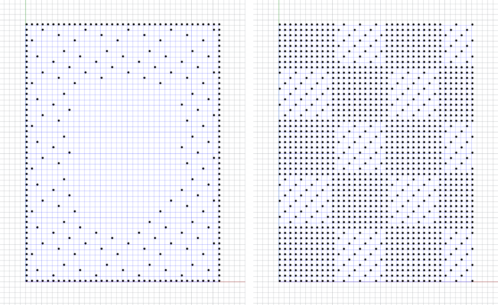
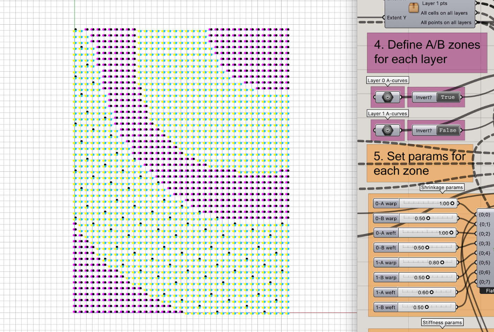
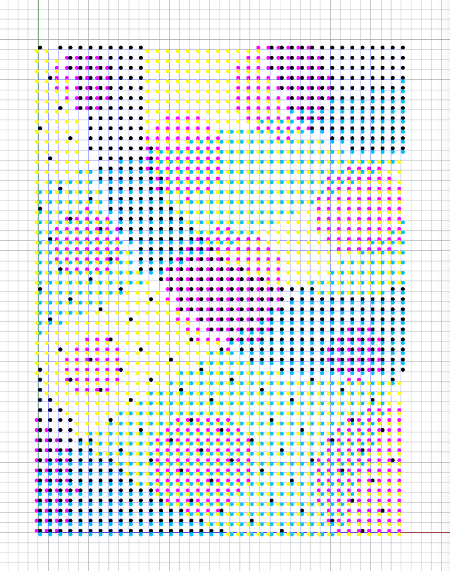
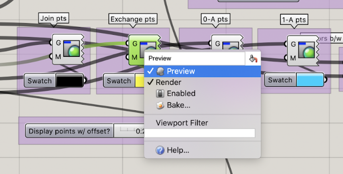
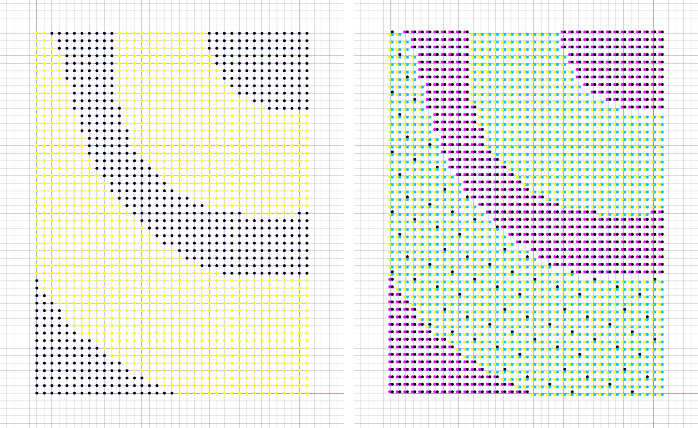
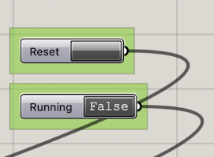
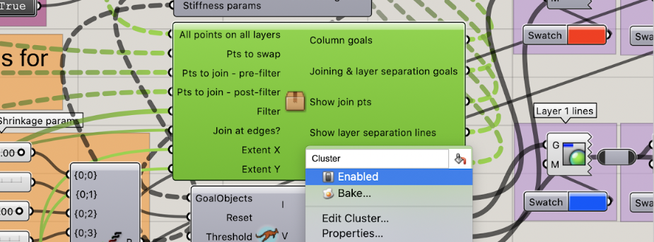

### Overview

This tool was created to support the design and ideation of self-shaping woven fabrics by quickly simulating surface relaxation. It can also be used as a design tool for non-textile materials, or simply for exploring the effects of differential shrinkage.

You'll need an up-to-date version of Rhino. To get started, open Woven Sketching v3.3dm, launch Grasshopper and open Woven Sketching v3.gh.

Each new design you create must be saved as a pair of .gh and .3dm files. (Or, if you prefer, create one .3dm file and many .gh files that reference it, as in the Sample Files folder.)

### Tips

Keep the Rhino window visible while working through these steps. When using the solver, keep the GH window visible at the edge of the screen, showing the Parameters section (step 5). Any screenshots taken will retain this info, and models will be easier to re-create later.

 
Model in relaxed position with all parameters visible for future reference.

If the solver component turns red (indicating an error) and clicking Reset does not fix it, it's possible wires were inadvertently disconnected - reopen the last working version of your file and try again. 

### 1. Set grid size

This sets the dimensions of the rectangular surfaces that represent a woven fabric. 

There are 2 parallel surfaces: Layer 0 (red) and Layer 1 (blue). These steps assume a 2-layer design, but the tool also supports single-layer designs. See the **Note on single-layer designs** at the end.

"Extent X" = width (weft direction).  
"Extent Y" = length (warp direction).  
Larger grid sizes will run more slowly. The default size of 36x48 is good for sketching.

For developing final designs, use a larger grid: the increased number of points on the grid allow each "yarn" to bend more times along its length, better approximating physical yarn behavior.

### 2. Select grid points to join or exchange

This step defines sets of grid points that will be joined or exchanged. Up to 3 selection sets can be created, consisting of one or more closed curves drawn in Rhino. Draw with any Rhino tool that creates curves, or import vectors into your .3dm file.

**Note**: Curves don't need to be planar. Points will be considered inside or outside a curve based on its projection along the z-axis onto the grid. FYI, "on" is "in".

Each selection set is connected to a unique behavior:

* **Points to exchange**: the lower point in the pair will be moved above the upper point. This is comparable to exchanging layers in doubleweave.  
 
Simplified example of exchanging layers. Points in the upper right and lower left quadrants were specified as points to exchange.  

* **Points to join**: All point pairs in the selection set are joined. This is comparable to a tiedown in doubleweave.  
 
Simplified example of joining layers. Points along the grid's midlines (marked with black dots) were specified as points to join.  

* **Points to filter + join**: The selection set is first modified by a selected "filter" (see below). All point pairs in the intersecting set are joined.  
A filter is an optional modification of the selection set. It can be used to quickly change the density and pattern of joins within a large region or the entire surface.

**Note**: Leaving some or all of the Geometry components empty is OK and will not affect the functionality of the solver. However, it's good to have some interaction between layers - otherwise you have 2 separate surfaces whose behaviors don't affect each other, not very interesting!

This step also includes a "Join at edges?" toggle that is False by default.

Right-click on a Geometry component (eg. "Points to Exchange") and select "Set one Geometry" or "Set Multiple Geometries" from the dropdown menu. Click on your curve in Rhino to select (it will turn green), holding down Shift and clicking to select additional curves.

A selection set can be inverted by double-clicking the boolean toggle next to it. For example, to select all points, select "Clear values" from the dropdown menu (the Geometry component will turn orange) and set the toggle to True.

 
Before and after inverting a selection set.

### 2a. (Optional) Re-assign behaviors to selection sets

This step is not necessary for all workflows, but may be helpful in experimental / improvised workflows, or quickly updating a design to observe the resulting changes.

Each light-green relay contains a path mask that will produce the set of points defined in step 2. Each dark-green relay indicates the behavior of point pairs in that set. By default, the 3 selection sets are connected to their corresponding behaviors. Connecting them in a different order may modify the design's relaxed state.

### 2b. (Optional) Apply a filter to joined points

To apply a filter, connect one of the blue Panel components to the Filter relay. The result will be a subset of the points defined in step 2 as "Points to filter + join".

**Optional**: To create a custom filter, add a Panel component to the canvas, right-click it and deselect "Multiline Data" from the dropdown menu. Enter a text pattern using these [selection rules](https://www.grasshopper3d.com/forum/topics/datatree-selection-rules). 

In this file, tree item {A;B}[C] is the point on layer A, in column B and row C. Phrased another way, point (x,y,z) is tree item {z;x}[y].

 
Left: "8 shaft satin" filter applied to a selection set, with border join set to True.  
Right: "10x10 checkerboard" _and_ "2x1 twill" filters applied to all points, with border join set to False.  
**Note**: connecting multiple filters to the relay (by holding down Shift) will combine them _before_ applying the filter to the selection set.

### 3. Define A/B zones for each layer

Each layer can be divided into "A" and "B" zones with distinct shrinkage and stiffness parameters (to be set in step 5). This is useful for sketching differential-shrinkage fabrics or multiple yarn types.

**Note**: Leaving one or both "A-curves" components empty is OK and will not affect the functionality of the solver.

Right-click on the "Layer 0 A-Curves" component and set the geometry to one or more closed curves. Repeat with "Layer 1 A-Curves". Use the Invert toggle if needed.

 
Magenta points indicate zone A on layer 0; non-magenta points indicate zone B. Layer 1 is marked in the same manner with cyan points. Zones may have multiple, discontinuous zones.

 
All 4 point sets (join, exchange, 0-A, 1-A) can be independent of each other (as above), but in practice the same boundaries are often used for multiple regions to produce specific behaviors.

### 4. Set parameters for each zone

The model contains 4 zones (0-A, 0-B, 1-A, 1-B), each of which can have unique values for weft shrinkage, warp shrinkage, weft stiffness and warp stiffness. Drag or double-click each number slider to set a value.

* **Shrinkage** values, ranging from 0 to 1, indicate the proportion of its original length that the area of fabric shrinks to when relaxed.  
This may be used to model the effects of felting, heat-shrinking yarns or other woven techniques: for example, to model a seersucker fabric in which warp A is advanced at ½ the rate of warp B, enter 0.5 for warp shrinkage in zone A.  
 
Simplified example of shrinkage params and their effects.

* A **stiffness** value of 0 indicates that the area of fabric is soft and bends easily (eg. fabrics woven with cotton, wool); a value of 1 indicates that it resists bending (eg. fabrics woven with thick monofilament, paper yarn, wire).  
Unlike shrinkage, the stiffness parameter is not directly tied to measurements of fabric behavior - it's more of a qualitative description.  
 
Simplified example of stiffness params and their effects.

### 5. Set display options 

Each Custom Preview component can be turned on (it will appear brighter) or off (it will appear shaded) by right-clicking and selecting "Preview" from the dropdown menu.

Click any Swatch component to change its color.

**Recommended**: Turn the preview on for grid lines (both layers) and point selection sets (the 4 groups with CMYK colors) when making design adjustments.

The "Display points w/ offset?" slider moves each point set slightly, to improve visibility where they overlap. Adjust to your desired appearance.

 
Left: 0-A and 1-A points are hidden when offset is set to 0. Right: Offset value of 0.25 is applied.

**Important:** Check the "Layer 0 surface" and "Layer 1 surface" toggles before moving on to step 6. These should be set to False for quicker performance. If they are set to True, each NURBS surface will be re-calculated with each iteration of the solver, slowing down performance and potentially crashing for large grid sizes. 

**Recommended workflow for quickest performance**: Start solver with surface toggles on False → Observe surfaces based on grid lines (Adjust as needed and repeat) → Pause solver → Set surface toggles to True.

### 6. Start solver

The two controls connected to the solver are a Reset button and a Running toggle (preset to False).

When ready to start the solver, click the Reset button. The solver should also be reset each time changes are made to parameters (step 4) or geometry (steps 1-3).

Double-click the Running toggle to switch it to True. The solver will start and the model will "relax" into a new position. 

**Note**: the Kangaroo solver component will likely say "Running" for a while and may not reach "Converged". That's OK! In this tool, you can consider the design converged once it is no longer visibly moving.

To pause the solver, double-click the Running toggle, or if Grasshopper is not responding hit the Esc key. (This sometimes pauses the solver and preserves the model in its current position - other times it makes the model disappear entirely until the solver is reset. 🤷)

Changes made to geometry (steps 1-4) while the solver is running will **not** update in real time. Stop the solver, make changes, click Reset and start again.

Changes made to parameters (step 5) **will** update in real time, but may not be accurate. The model will move according to the new parameters, but it's starting from a position that it may not have been able to get into if those parameters had been set from the start. 

**Note on single-layer designs**: Follow steps 1-6 with a few modifications. For consistency, these notes assume that all single-layer designs utilize Layer 0 only.

* Skip steps 2, 2a and 2b.
* In step 3, leave the Layer 1 A-curves component empty.
* In step 4, set all Layer 1 parameters to default values (shrinkage = 1, stiffness = 0).
* In step 5, turn off visibility for all Layer 1 custom preview components.

**Known issue with single-layer designs:** Some single-layer fabric designs fail to simulate properly when the cluster that controls layer joins is enabled (and some others fail when it's not enabled) An effective workaround is:

* Follow all steps with single-layer modifications and start solver as usual
* Stop solver, reset, and disable the cluster that controls layer joins and exchanges
* Reset and start the solver again, noting any changes in appearance
* This may need to be done each time the file is opened.

### Terms used:

**Exchange** - referring to a pair of points. The lower-layer point is moved above the upper-layer point when the solver starts. Similar to exchanging layers of doubleweave.

**Join** - referring to a pair of points. The vertical distance between the points is reduced nearly to zero when the solver starts. Similar to a tie-down in doubleweave fabric.

**Layer** - ("0" or "1", "lower" or "upper"). A single rectangular surface, representing a single layer of woven fabric.

**Pair of points** - a point on the lower grid (Layer 0) and the corresponding point in the same location on the upper grid (Layer 1).

**Path mask** - text used to select specific items from a data tree, in this case to create a set of selected points.

**Warp** - yarns that run vertically in a woven fabric.

**Weft** - yarns that run horizontally in a woven fabric.

**Zone** - ("A" or "B"). A 2D region that is a subset of all points on a layer.
